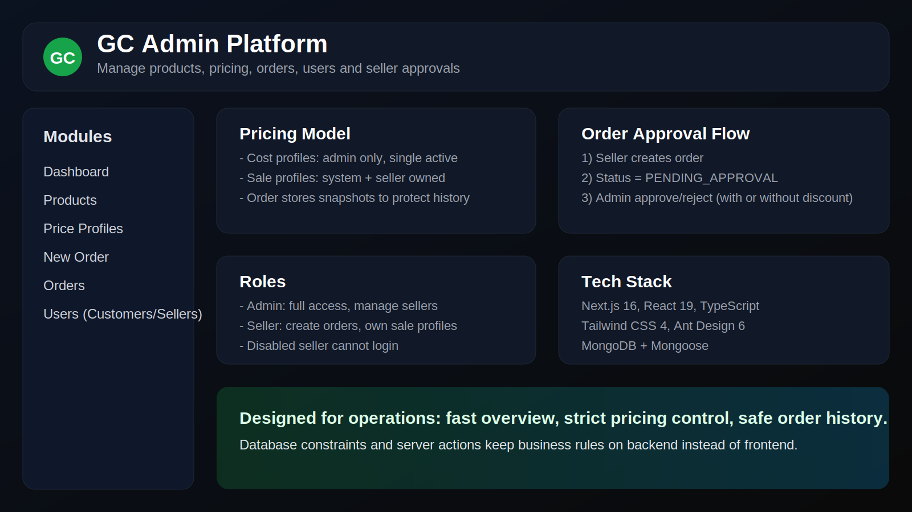

# GC Admin

Nền tảng admin quản lý bán giò chả theo mô hình `price profile` (giá vốn/giá bán), tối ưu cho vận hành nhiều seller và tracking lãi lỗ theo từng đơn hàng.




## 1. Mục tiêu dự án

- Quản lý sản phẩm theo kg.
- Tách biệt `cost profile` và `sale profile` để thay đổi giá linh hoạt theo thời điểm.
- Snapshot giá tại thời điểm lên đơn để **không làm sai lịch sử đơn cũ**.
- Seller tạo đơn nhưng admin kiểm duyệt trước khi đơn chuyển sang `Confirmed`.
- Hỗ trợ xin discount và quy trình duyệt discount dành cho admin.

## 2. Tính năng chính

### Dashboard
- Tổng quan doanh thu, lợi nhuận, trạng thái đơn.
- Quick actions để đi nhanh tới Lên đơn / Profile giá.

### Products
- CRUD sản phẩm (name, description, active status).
- Hiển thị giá bán mặc định theo profile đang áp dụng.

### Price Profiles
- `COST`: chỉ admin được quản lý, chỉ 1 profile active duy nhất.
- `SALE`: admin tạo profile hệ thống, seller tạo profile riêng.
- Clone profile nhanh để tạo version mới khi thay đổi 1 hoặc nhiều món.
- Form tạo profile trong drawer + confirm modal + generate test data.

### New Order
- Chọn customer, ngày giao, sale profile.
- Giỏ hàng theo khối lượng kg.
- Nếu seller cần bán thấp hơn profile hệ thống: gửi discount request.

### Orders
- Bộ lọc trạng thái + ngày + search.
- Admin panel duyệt đơn chờ:
  - so sánh giá gốc, giá xin discount, chi phí, lợi nhuận dự kiến.
  - duyệt/không duyệt discount hoặc từ chối đơn.
- Chỉ sau khi duyệt, đơn mới chuyển `PENDING_APPROVAL -> CONFIRMED`.

### Users (Customers + Sellers)
- Tab Customer: quản lý người mua.
- Tab Seller: quản lý tài khoản bán hàng.
- Admin có thể tạo seller, reset password, enable/disable seller.
- Seller disabled sẽ không thể login.

### Account
- Đổi mật khẩu tài khoản hiện tại.

### Login + i18n
- Login bằng tài khoản seller/admin.
- Hỗ trợ 2 ngôn ngữ: `vi` và `en`.

## 3. Quy tắc nghiệp vụ quan trọng

- Mọi đơn do seller tạo đều cần admin duyệt.
- Discount request chỉ xử lý ở backend (server actions + DB query), không tin frontend.
- Lịch sử đơn hàng được bảo toàn vì mỗi order lưu snapshot:
  - giá vốn,
  - giá bán gốc,
  - giá sau discount (nếu có),
  - profile sử dụng tại thời điểm tạo/duyệt.

## 4. Công nghệ

- Next.js 16 (App Router)
- React 19
- TypeScript
- Tailwind CSS 4
- Ant Design 6
- MongoDB + Mongoose
- next-intl

## 5. Cấu trúc module

Dự án đang tách theo từng page/module để dễ kiểm soát:

```text
src/app/(admin)/<module>/
  page.tsx
  actions.ts
  typing.d.ts
  components/
```

Ví dụ:

- `src/app/(admin)/products/`
- `src/app/(admin)/price-profiles/`
- `src/app/(admin)/orders/`
- `src/app/(admin)/customers/`
- `src/app/(admin)/dashboard/`
- `src/app/(admin)/account/`
- `src/app/login/`

## 6. Thiết kế dữ liệu (high-level)

### `products`
- Thông tin sản phẩm, không lưu giá trực tiếp.

### `priceprofiles`
- Lưu version bảng giá theo loại `COST | SALE`.
- Mỗi profile chứa mảng `items` với `productId`, `productName`, `pricePerKg`.

### `orders`
- Lưu snapshot profile + line item theo kg.
- Có `approval` và `discountRequest` để xử lý luồng seller -> admin.

### `customers`, `sellers`, `seller-sessions`
- Quản lý người mua, tài khoản seller/admin và phiên đăng nhập.

## 7. Cài đặt local

### Yêu cầu
- Node.js 20+
- MongoDB Atlas hoặc MongoDB local

### Cài dependencies

```bash
npm install
```

### Biến môi trường

Tạo file `.env.local`:

```bash
MONGODB_URI=<your_mongodb_connection_string>
MONGODB_DB=gc_admin

# optional defaults for auto bootstrap admin account
ADMIN_EMAIL=admin@gc.vn
ADMIN_NAME=GC Admin
ADMIN_PASSWORD=Admin@123
```

### Chạy dev

```bash
npm run dev
```

Mở: `http://localhost:3000`

## 8. Build production

```bash
npm run lint
npm run build
npm run start
```

## 9. Deploy Vercel

```bash
vercel
vercel --prod
```

Nếu cần kéo env về local:

```bash
vercel env pull .env.local
```

## 10. Tài khoản mặc định

Nếu hệ thống chưa có admin, app sẽ tự tạo tài khoản admin từ biến môi trường.
Mặc định fallback:

- Email: `admin@gc.vn`
- Password: `Admin@123`

Khuyến nghị đổi ngay sau lần đăng nhập đầu tiên.
