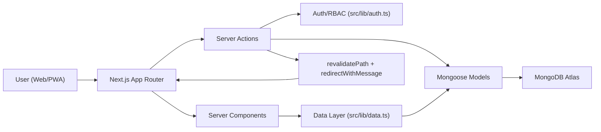
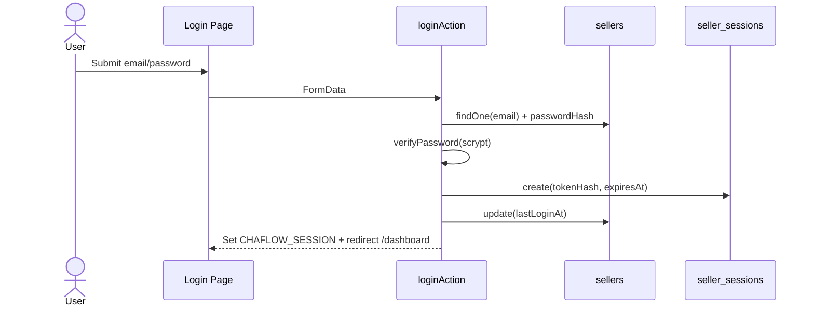
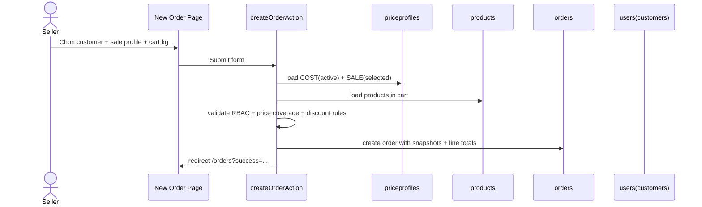
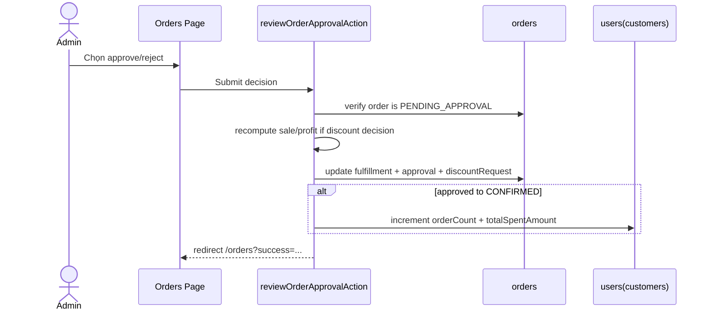
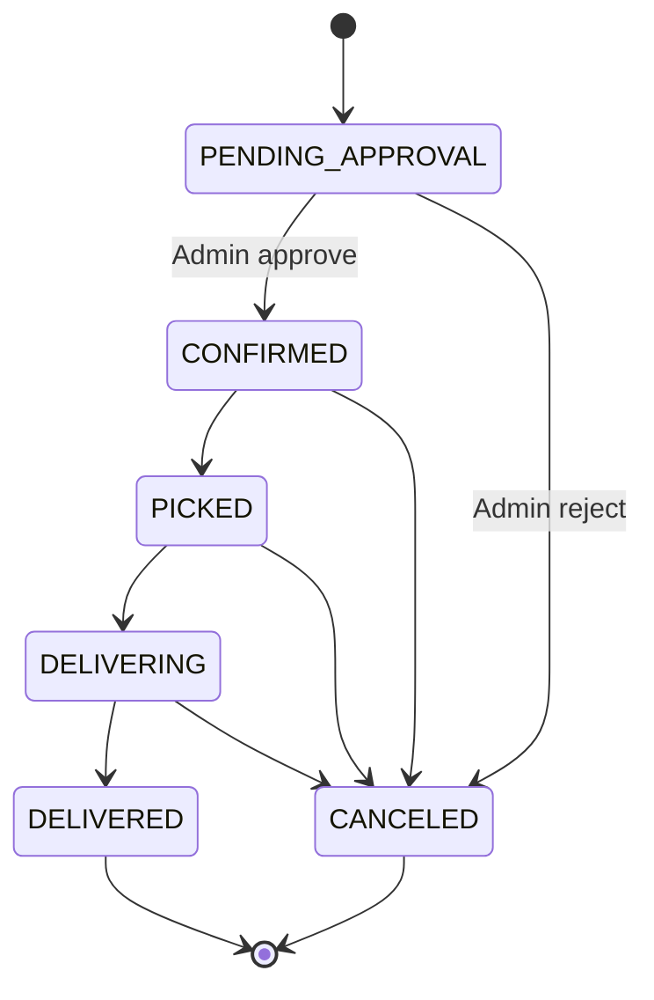
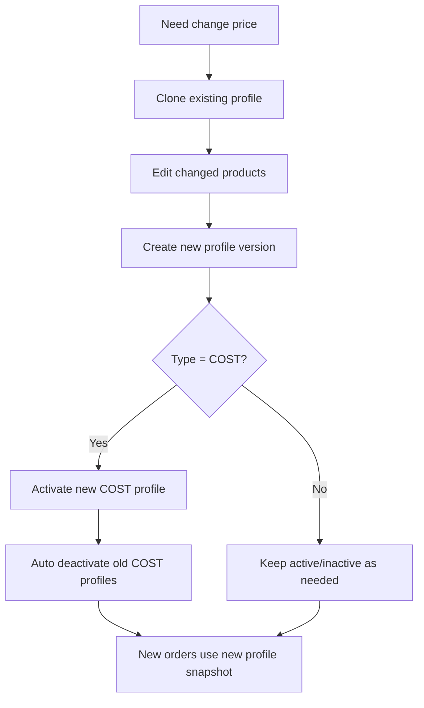
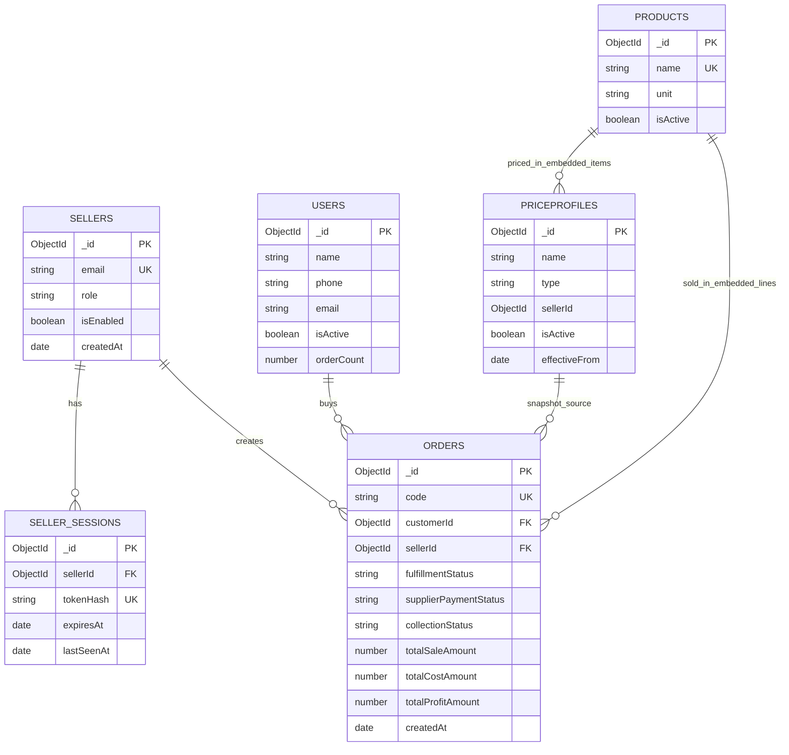

# GC Admin - Technical Handover (Dev)

Tài liệu này dành cho kỹ sư tiếp quản dự án sau này. Mục tiêu là đọc 1 lần có thể:

- hiểu kiến trúc tổng thể,
- nắm luồng nghiệp vụ cốt lõi,
- hiểu DB design và index,
- biết điểm cần chú ý khi mở rộng hệ thống.

---

## 1. Tài liệu liên quan

- Vận hành cho user/seller/admin: [`ONBOARDING_PLAYBOOK.vi.md`](./ONBOARDING_PLAYBOOK.vi.md)
- Technical handover (file hiện tại): [`TECHNICAL_HANDOVER.vi.md`](./TECHNICAL_HANDOVER.vi.md)

---

## 2. Stack kỹ thuật

- Framework: Next.js `16.1.6` (App Router)
- Runtime UI: React `19.2.3`
- DB: MongoDB + Mongoose `9.2.1`
- Styling: TailwindCSS 4 + custom CSS + Ant Design 6 (selective)
- i18n: next-intl (`vi`, `en`)
- Auth: cookie session + hashed password (`scrypt`)
- PWA: manifest + service worker + install prompt mobile

---

## 3. Kiến trúc tổng thể



Nguyên tắc chính:

- UI không tin dữ liệu từ client cho nghiệp vụ nhạy cảm.
- Validation, authorization, query filtering đều xử lý ở server.
- Query/filter/search theo status/date/seller thực hiện ở database.

---

## 4. Cấu trúc module

```text
src/app/(admin)/
  dashboard/
  products/
  price-profiles/
  orders/
  customers/
  account/
  layout/
src/app/login/
src/app/components/
src/lib/
src/models/
src/messages/
src/css/
```

Các server actions chính:

- `loginAction` tại `src/app/login/actions.ts`
- `createOrderAction`, `updateOrderStatusesAction`, `reviewOrderApprovalAction` tại `src/app/(admin)/orders/actions.ts`
- `createPriceProfileAction`, `togglePriceProfileStatusAction`, `clonePriceProfileAction` tại `src/app/(admin)/price-profiles/actions.ts`
- `upsertProductAction`, `toggleProductStatusAction`, `deleteProductAction` tại `src/app/(admin)/products/actions.ts`
- `upsertCustomerAction`, `toggleCustomerStatusAction`, `upsertSellerAction`, `toggleSellerStatusAction`, `resetSellerPasswordAction` tại `src/app/(admin)/customers/actions.ts`
- `seedInitialDataAction` tại `src/app/(admin)/dashboard/actions.ts`
- `changePasswordAction` tại `src/app/(admin)/account/actions.ts`

---

## 5. Auth và session

### 5.1 Cách hoạt động

- Cookie session name: `CHAFLOW_SESSION`
- Cookie lưu raw token; DB lưu `tokenHash` (SHA-256)
- Password hash: `scrypt`
- TTL session: 14 ngày
- Seller bị disable sẽ bị revoke session ngay

### 5.2 Login sequence



---

## 6. Luồng nghiệp vụ core

### 6.1 Luồng tạo đơn (seller)



Rule quan trọng:

- Seller chỉ được chọn sale profile của chính seller hoặc profile hệ thống.
- Discount request của seller chỉ hợp lệ khi dùng sale profile hệ thống.
- Order của seller tạo sẽ vào `PENDING_APPROVAL`.

### 6.2 Luồng duyệt đơn (admin)



### 6.3 State machine của order



### 6.4 Luồng price profile versioning



---

## 7. DB design

### 7.1 Collection map

| Collection | Model | Mục đích |
| --- | --- | --- |
| `products` | `Product` | Danh mục sản phẩm bán theo kg |
| `priceprofiles` | `PriceProfile` | Version bảng giá COST/SALE |
| `orders` | `Order` | Đơn hàng + snapshot giá + approval + discount |
| `users` | `Customer` | Người mua (customers) |
| `sellers` | `Seller` | Tài khoản seller/admin |
| `seller_sessions` | `SellerSession` | Session đăng nhập có TTL |

Lưu ý:

- Customer model dùng collection name là `users`.
- `orders.items` và `priceprofiles.items` là embedded array (không tách collection riêng).

### 7.2 ERD logical



### 7.3 Index strategy (đang dùng)

### products

- `{ name: 1 } unique`

### priceprofiles

- `{ type: 1, isActive: 1, effectiveFrom: -1 }`
- `{ type: 1, sellerId: 1, effectiveFrom: -1, createdAt: -1 }`

### orders

- `{ code: 1 } unique`
- `{ deliveryDate: -1, createdAt: -1 }`
- `{ customerId: 1, createdAt: -1 }`
- `{ sellerId: 1, createdAt: -1 }`
- `{ "approval.status": 1, createdAt: -1 }`
- `{ "discountRequest.status": 1, createdAt: -1 }`

### users (customers)

- `{ name: 1 }`
- `{ phone: 1 }`
- `{ email: 1 } sparse`
- `{ isActive: 1, createdAt: -1 }`

### sellers

- `{ email: 1 } unique`
- `{ role: 1, isEnabled: 1, createdAt: -1 }`

### seller_sessions

- `{ tokenHash: 1 } unique`
- `{ sellerId: 1 }`
- TTL index `{ expiresAt: 1 }` với `expireAfterSeconds: 0`

---

## 8. Query/filter strategy (backend-first)

Nguyên tắc:

- Search/filter không xử lý ở frontend.
- Frontend chỉ gửi params, backend build query.

Điểm chính:

- Orders page filter dùng `buildOrdersQuery` trong `src/lib/data.ts`.
- Price profiles filter (`status`, `search`, `owner`) xử lý trong `listPriceProfiles`.
- Seller view chỉ thấy sale profile của bản thân + system profile.
- Aggregation thống kê seller/customer thực hiện bằng MongoDB aggregate.

---

## 9. Invariants nghiệp vụ cần giữ

1. Luôn giữ snapshot giá trong order.
2. Discount request của seller chỉ hợp lệ với system sale profile.
3. Chỉ admin được duyệt order pending.
4. Chỉ admin được quản lý COST profile.
5. COST profile active phải duy nhất.
6. Seller bị disable không được login.
7. Các action nhạy cảm phải check role ở server.

---

## 10. UI/UX kỹ thuật

- Notification dùng Antd notification qua query param `success`/`error`, xử lý tại `FlashNotificationListener`.
- Loading chuyển trang và submit form dùng `AppTransitionIndicator`.
- PWA install modal mobile tại `PwaMobileInstall`.
- i18n dùng cookie `NEXT_LOCALE`, messages nằm ở `src/messages`.

---

## 11. Runbook dev

### 11.1 Env vars

```bash
MONGODB_URI=...
MONGODB_DB=gc_admin
ADMIN_EMAIL=admin@gc.vn
ADMIN_NAME=GC Admin
ADMIN_PASSWORD=Admin@123
```

### 11.2 Local commands

```bash
npm install
npm run dev
npm run lint
npx tsc --noEmit
```

### 11.3 Deploy

- Deploy lên Vercel.
- Cấu hình env vars trên Vercel project.
- MongoDB nên bật IP allowlist + user privilege tách theo môi trường.

Lưu ý seed dữ liệu:

- `seedInitialDataAction` hiện tạo SALE profile ban đầu gắn `sellerId` của admin chạy seed.
- Nếu muốn SALE profile hệ thống đúng nghĩa (không owner), tạo thêm profile SALE bằng màn hình Price Profiles sau khi seed.

---

## 12. Checklist bàn giao cho dev mới

1. Chạy được local + login được admin.
2. Tạo được product/profile/order end-to-end.
3. Test luồng seller xin discount -> admin duyệt.
4. Kiểm tra filter orders và price profiles chạy bằng DB query.
5. Kiểm tra TTL session và disable seller revoke session.
6. Đọc model/index trước khi sửa schema.

---

## 13. Backlog kỹ thuật đề xuất

1. Bổ sung migration strategy versioned cho schema lớn.
2. Tách service layer rõ hơn giữa action và domain rules.
3. Thêm audit log riêng cho quyết định duyệt/reject.
4. Thêm pagination server-side cho orders volume lớn.
5. Tăng cường integration tests cho các luồng approval/discount.
